# fluidplan

A skill for Claude Code, Codex, and Gemini in Antigravity that turns a plan into a small web app you
**decide** instead of a long Markdown file you read.

## Version 1.2.0 — clearer reading, automatic implementation on Codex

Start with a short overview of the goal, changes and risks. Read decisions in **Summary** or
**Detailed** density, reopen an accepted card to inspect its choices, and read the final plan as
a document with a contents list, task criteria and a Markdown source view.

On **Codex**, sending a fully settled round now leads directly to the retained implementation
in the same active session. Round 1 is enough; round 2 and later work the same way. Questions
and change requests are revised first. An explicit **review-only** plan produces the documents
without implementation.

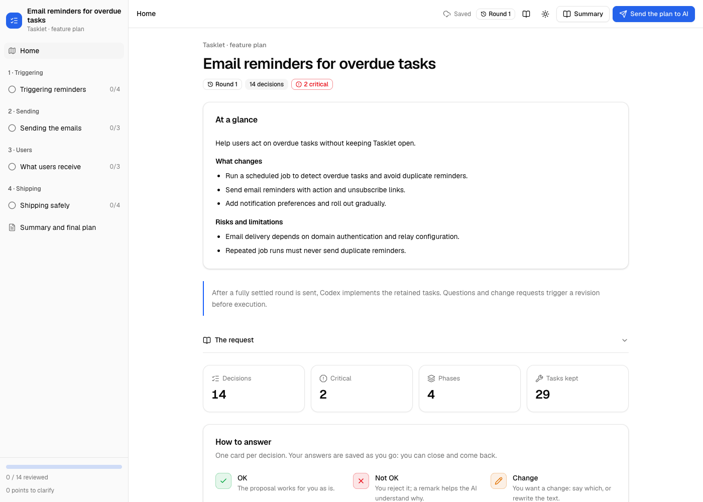

## What it does

1. The AI turns a plan into a local web app: one page per theme, one card per decision. The plan
   can be a proposal document you already have, or the plan the AI designs for your request.
2. You answer each card: **OK**, **Not OK**, **Change** or **Explain**. You can also rewrite any
   text in place.
3. You click **Send the plan to AI**. If a change or question needs a response, the AI revises it
   and opens the next round, with a note and a diff. Your other answers are kept.
4. When everything is settled, the AI writes two files:
   - **PLAN.md**: the tasks, phase by phase, with the files to touch, acceptance criteria and
     verify commands. On Codex, the assistant executes the retained tasks automatically unless
     you requested review only.
   - **DECISIONS.md**: every choice, why it was made, and what was ruled out.

## Requirements

- Claude Code, Codex, or Gemini in Antigravity, with terminal execution tools
- Node.js 20 or later
- Any modern browser

## Install

Install the complete skill folder in your client's global skills directory:

| Client | Directory | Explicit invocation |
|---|---|---|
| Claude Code | `~/.claude/skills/fluidplan` | `/fluidplan` |
| Codex | `~/.codex/skills/fluidplan` | `$fluidplan` |
| Antigravity IDE / 2.0 | `~/.gemini/config/skills/fluidplan` | `/fluidplan` |
| Antigravity CLI | `~/.gemini/antigravity-cli/skills/fluidplan` | `/fluidplan` |

For example, for Claude Code (use the matching directory above for another client):

```bash
git clone https://github.com/morganhub/fluidplan.git ~/.claude/skills/fluidplan
```

On Windows (PowerShell):

```powershell
git clone https://github.com/morganhub/fluidplan.git "$HOME\.claude\skills\fluidplan"
```

Start a new assistant session. The skill is available in every project; there is nothing to
install in the projects themselves.

## Use

Open your assistant in your project (outside a read-only plan mode) and ask, for example:

- *"Present `docs/proposal.md` with fluidplan."* — a `.md`, `.txt`, `.docx` or `.pdf` document
- *"Design the plan to add e-mail reminders and present it with fluidplan."*
- or invoke the skill using the command for your client above, followed by your request

Then:

1. The AI writes the plan in `.fluidplan/<id>/`, checks it, and opens it in your browser.
2. You answer the cards. Answers are saved as you go: you can close the page and come back.
3. You click **Send the plan to AI**. The AI revises the plan and the page reloads into the next round.
4. You repeat until everything is settled. The AI then writes `PLAN.md` and `DECISIONS.md`.
5. On Codex, the AI implements the retained tasks automatically in the same active turn.
   An approved round 1 is enough; rounds 2 and later work identically. Questions, pending
   answers and requested revisions are settled first. Ask for exploration only (or set
   `execution: "review"` / create with `new --review-only`) to receive documents without implementation.

Keep the assistant session active during review. Claude Code uses its existing background wait
and completion notifications. Codex and Antigravity keep an active turn awaiting the tracked wait
command. No chat message is needed between rounds. See [`references/assistants.md`](references/assistants.md).
After an interrupted session, *"sent"* in the conversation is a recovery option.
The page approves the reviewed work; it does not change Codex tool permissions. A plan or
answer edited after submission must be reviewed again before automatic implementation.

The home page supports a short authored overview (`summary.goal`, `changes`, `risks`).
Switch between summary and detailed reading from the header; the preference is saved locally.
Proposals, choices and critical warnings remain visible. The final files have rendered Markdown
previews, a contents list and a source view. Mobile verdicts and navigation keep their labels.

## A plan, step by step

These screenshots show the bundled [example project](examples/tech-feature): a plan to add
email reminders to a small task app. The screenshot script plays a demonstration review and
simulates the assistant's revisions; it does not implement the example's tasks.

**1. Understand the decision.** The proposal, expected benefit and main tradeoff lead the card.
Choices remain visible, and critical warnings stay visible in either density.

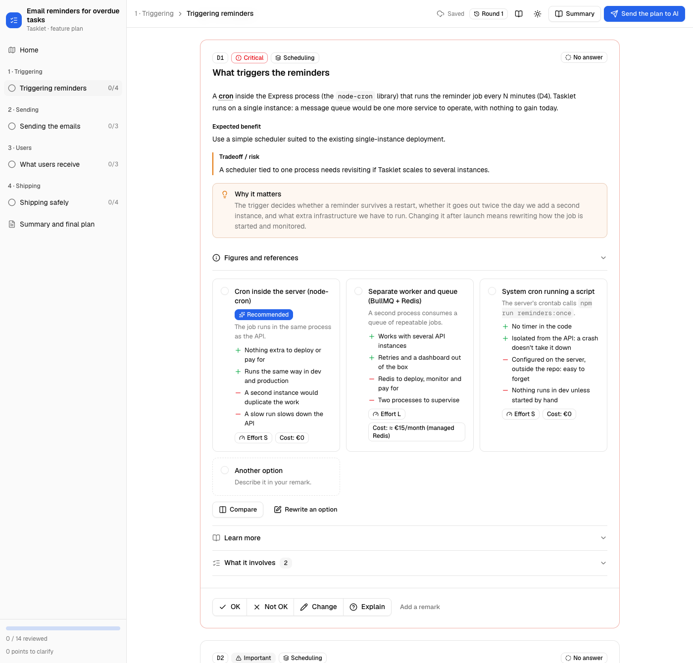

**2. Choose the depth of reading.** Switch to **Detailed** to open supporting explanations,
figures and diagrams. The preference is stored locally, and switching keeps unsaved text.

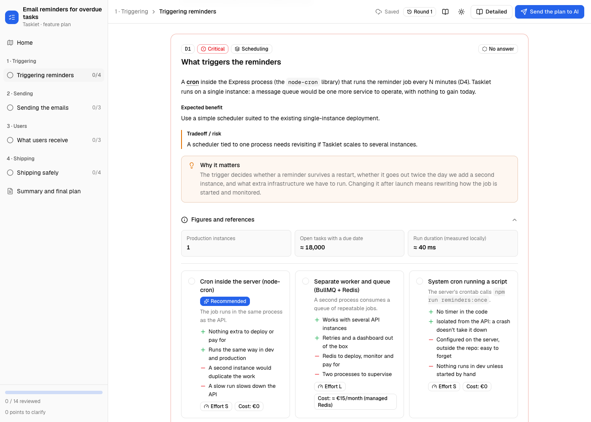

Accepted cards fold when revisiting a page in Summary density. The retained choice and critical
warning stay visible; **Review / change choices and details** reopens the card.

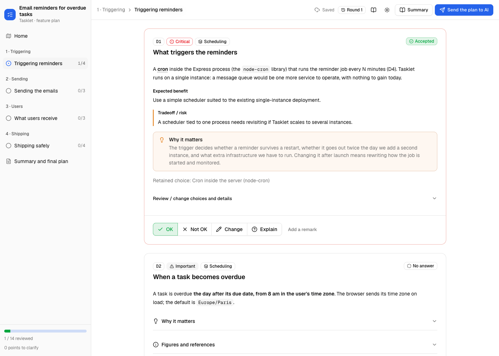

**3. Answer in your own words.** Choose **OK**, **Not OK**, **Change** or **Explain**, or rewrite
the proposal. A change needs a remark or rewrite; a question needs its text.

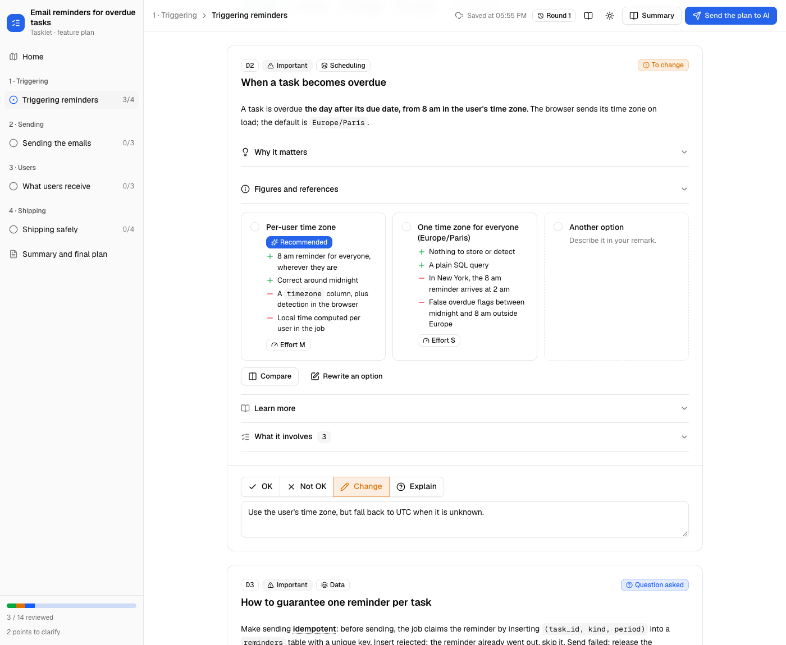

**4. Send the round.** The dialog shows accepted, rejected, pending and unresolved decisions,
and explains what follows submission. A question or requested change is processed before implementation.

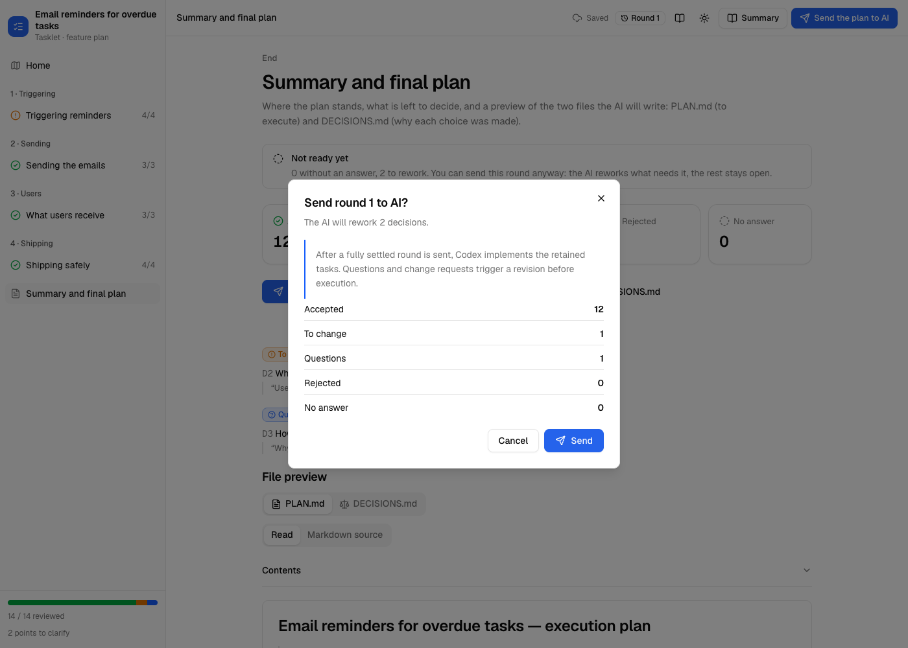

**5. Review what changed.** The next round opens automatically. Accepted answers survive;
the default filter brings back the decisions that still need your response.

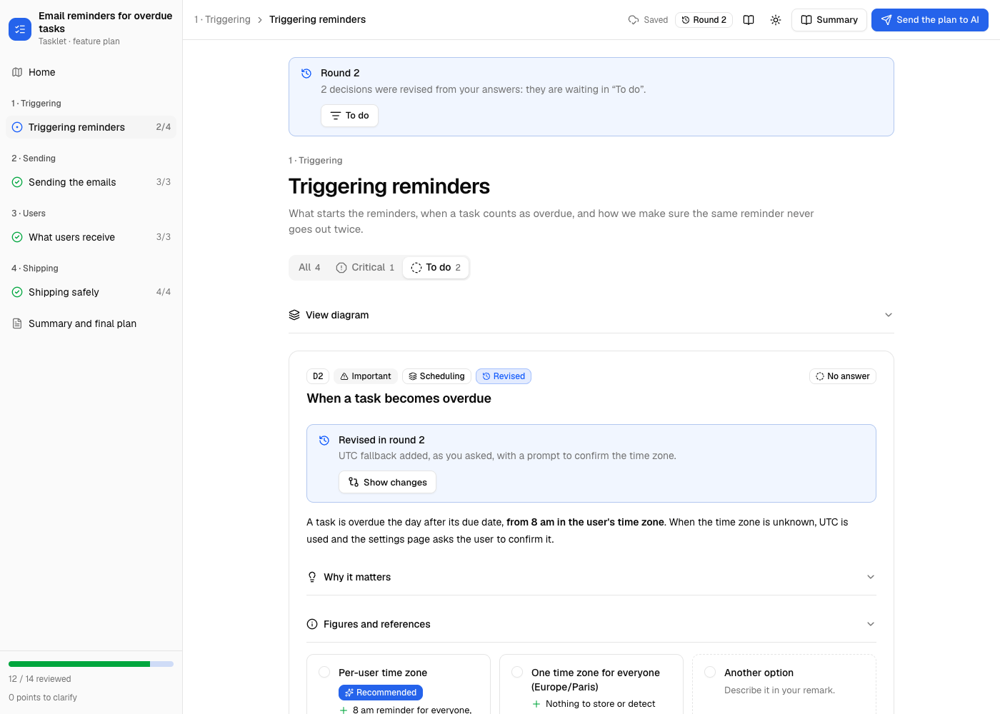

Open the diff to see the proposal before and after the revision.

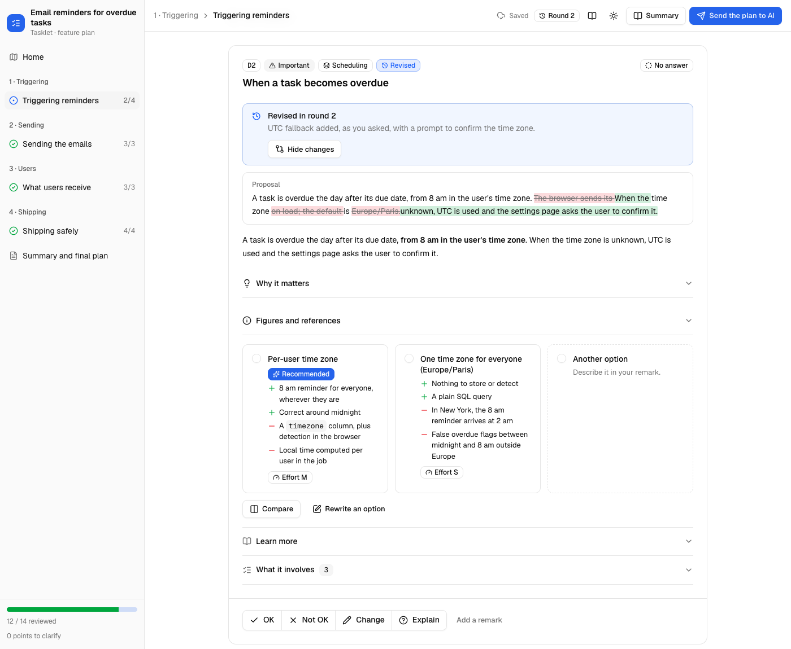

**6. Approve the settled work.** This round has no pending answers, questions or required
revisions. In an active Codex session, submission is the approval to finalize and implement the
retained tasks, without another “execute the plan” message in chat. This also works at round 1.

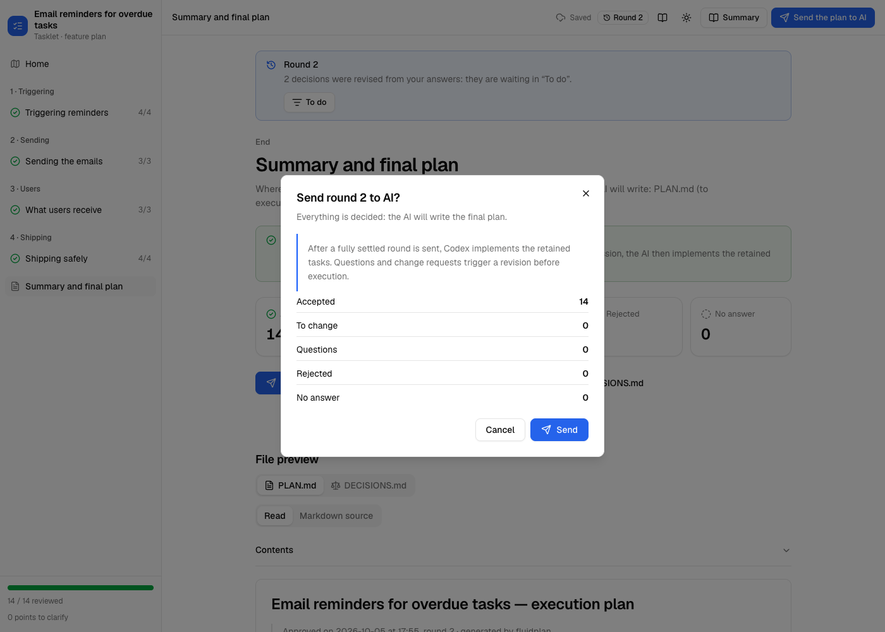

**7. Read the final documents.** The summary gives the tally, downloads and finalized files.
For review-only plans, this is the outcome; automatic Codex plans continue with implementation.

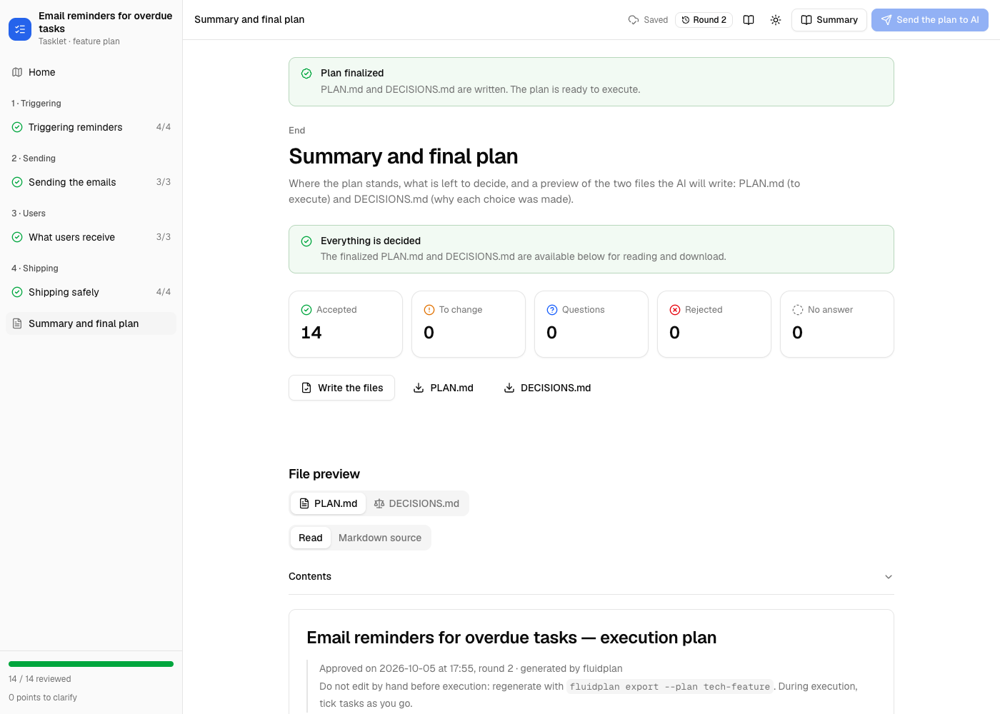

**PLAN.md** opens as rendered Markdown. Use the contents list to reach a section without
leaving the page.

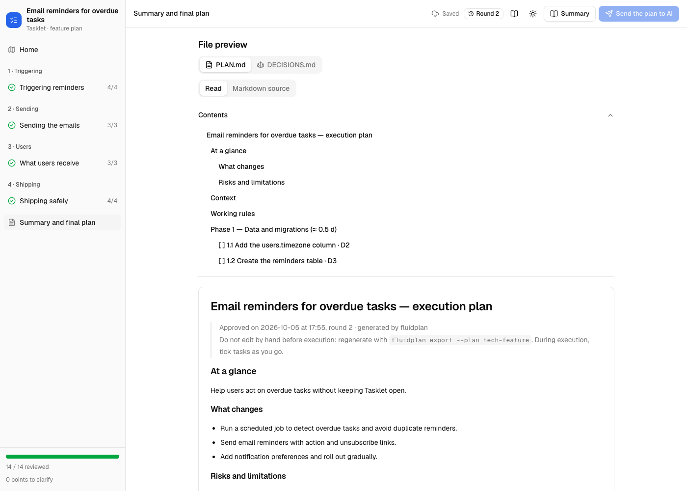

Tasks show the files to change, acceptance criteria and verification commands. The preview's
checkboxes are read-only; implementation progress is recorded in the generated file by the assistant.

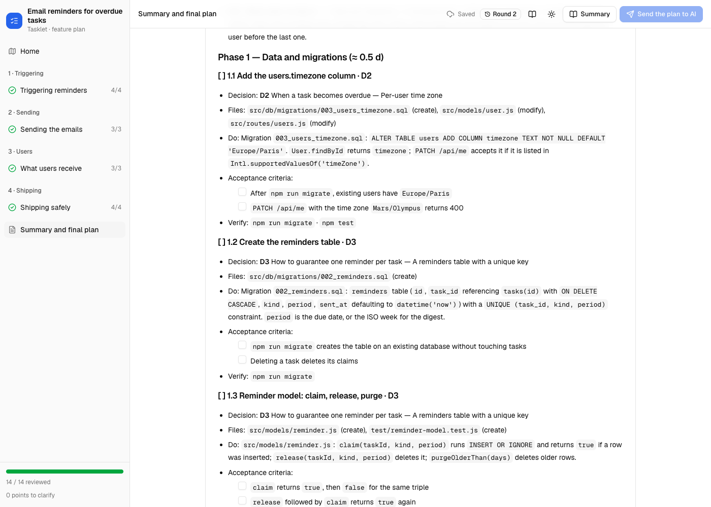

Switch to **Markdown source** to inspect the same text that is exported and downloaded.

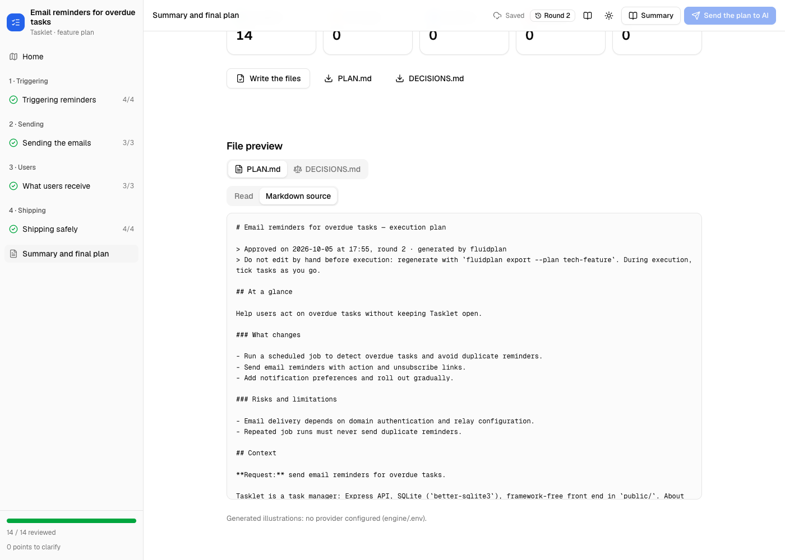

**Dark theme and mobile.** The same interface works in both themes. Mobile keeps visible labels
for verdicts, submission and page navigation.

<p>
  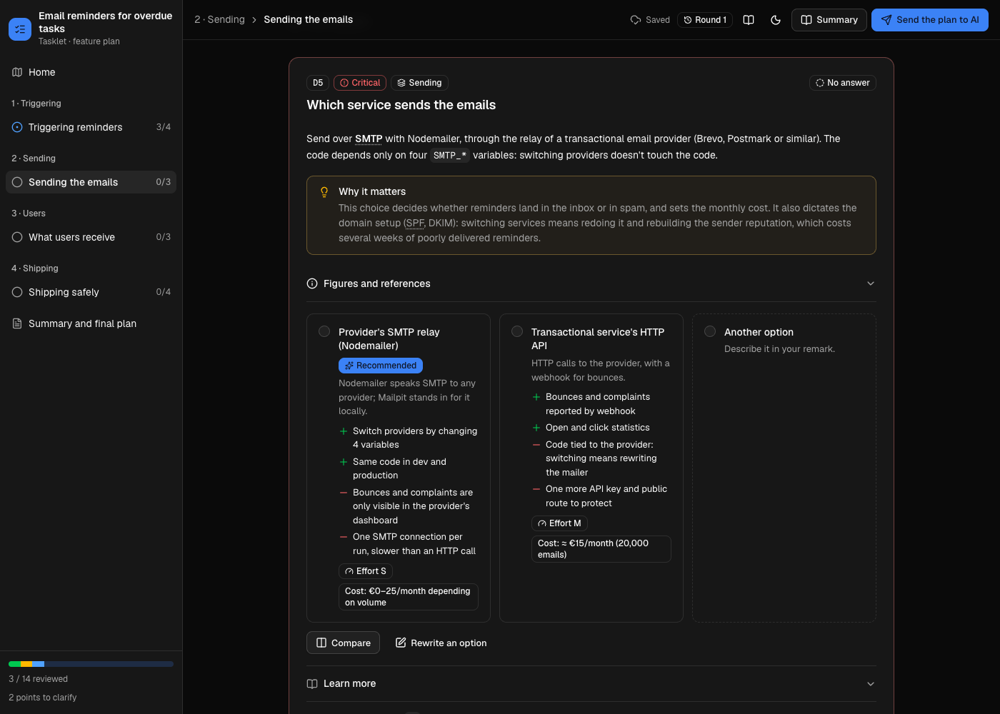
  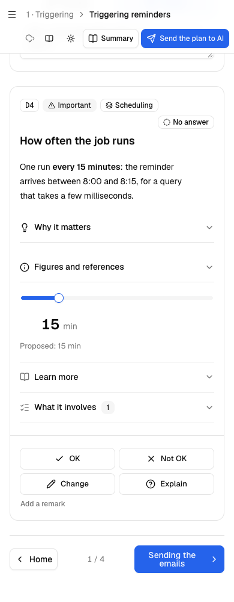
</p>

## Features

- **Short overview.** An authored goal, concrete changes and risks on the home page. Length
  warnings help keep proposals concise; text is never automatically truncated.
- **Progressive reading.** Summary and Detailed densities, supporting explanations on demand,
  accepted cards that reopen, and visible critical consequences.
- **Readable exports.** Rendered Markdown, semantic headings, contents navigation, nested lists,
  read-only task checkboxes, tables, quotes, code copying and a source view.
- **Codex implementation.** A settled submitted round automatically continues with retained
  tasks. `execution: "review"` opts into documents only; `new --review-only` creates that mode.
- **Decision cards.** Four answers per card: OK, Not OK, Change (with a remark or a rewrite) and
  Explain (a question). Each card shows why the decision matters, and what it involves as tasks.
- **Controls.** Single choice (options with pros, cons and effort, plus a side-by-side compare
  view), multiple choice, a number slider, lists judged item by item, and phase ordering.
- **Importance.** Critical decisions stand out; minor ones are grouped and can be accepted in one
  click; a filter shows only what is left to do.
- **Glossary.** Terms are explained on hover.
- **Rounds.** Only revised decisions come back. Answers you already gave are kept.
- **Visuals.** 15 built-in visuals: timeline, diagram, compare table, file tree, risk matrix,
  before/after, code, stats and more. A plan can also bring its own visual as a small JS module.
- **Illustrations (optional).** An image can be generated for a visual with OpenAI, Google Gemini,
  Ludo.ai or Meshy, with a limit of 5 per service and per plan.
- **Inputs.** Markdown, text, Word (`.docx`, read by a built-in converter) and PDF, or a plan the AI
  designs from your request.
- **Languages.** English (default) or French, set per plan.
- **Local interface.** A small Node server on `127.0.0.1` with no dependencies. The page makes
  no external request; optional illustrations use the configured provider. The assistant
  continues to use its existing AI client.

## Configuration (optional)

A `fluidplan.config.json` at the root of a project:

| Key | Default | Meaning |
|---|---|---|
| `plansDir` | `.fluidplan` | where plans are stored |
| `outputDir` | `{plansDir}/{id}` | where `PLAN.md` and `DECISIONS.md` are written |
| `lang` | `en` | language of new plans (`en` or `fr`) |
| `accent` | `neutral` | main color: `neutral`, `blue`, `green`, `orange`, `rose`, `violet`, `yellow` |
| `port` | `5178` | server port (the next free one is used if taken) |
| `imagesPerProvider` | `5` | illustration limit per service and per plan (can be lowered, not raised) |

Illustration services read their keys from `engine/.env` in the skill folder (see
[`engine/.env.example`](engine/.env.example)).

---

## Technical overview

### How a round works

```
the AI writes plan.json ──► fluidplan serve ──► the page (you answer; answers.json)
        ▲                                               │
        │                                     "Send the plan to AI" (state.json: submitted)
        │                                               │
   plan.json revised  ◄── digest ◄── fluidplan wait ◄───┘
   ("revision": { "round": n+1, "note" })
        │
        └──► fluidplan next-round ──► the page reloads into round n+1 ──► … ──► fluidplan finalize
                                                                                  PLAN.md, DECISIONS.md
                                                                                          │
                                                                            Codex auto ──► accepted tasks
```

- The AI keeps `serve` running and listens through `wait`. Claude Code uses background task
  completion; Codex and Antigravity await the tracked job in an active turn. `wait` exits when
  you send the round and returns a **digest** of what to rework.
- Automatic implementation requires a settled submission whose plan and answers still match
  the archived round. A draft export, an unresolved answer or an edit after submission does
  not supply that approval. The active assistant performs the work; the server does not run
  the plan's commands.
- Each file has a single writer. The AI writes `plan.json`. The page writes `answers.json`. The
  engine writes `state.json` and `images.json`.
- `next-round` refuses to run if a decision to rework has no `revision` for the next round. It
  resets only the answers of revised decisions and archives each round in `rounds/<n>/`.

### Files in a project

```
.fluidplan/<id>/
  plan.json          the plan (written by the AI)
  answers.json       your answers (written by the page)
  state.json         round and status
  images.json        generated illustrations and usage per service
  rounds/<n>/        each round as sent, with its digest
  assets/  visuals/  images and visual extensions of the plan
  PLAN.md  DECISIONS.md
```

### CLI

The AI drives the engine through one command, run from the project root:
`node ~/.claude/skills/fluidplan/engine/fluidplan.mjs <command>`.

| Command | What it does |
|---|---|
| `new --plan <id> --title "…" [--review-only]` | creates a plan; review-only skips Codex implementation |
| `check` | validates plans: errors block, warnings point at weak spots (a missing "why", a decision without tasks) |
| `serve [--open]` | serves the page (reuses a running instance) |
| `wait [--timeout seconds]` | blocks until the round is sent, then prints the digest; a bounded timeout returns exit code 3 |
| `digest` | what the AI has to rework in this round |
| `next-round` | opens the next round after `plan.json` was revised |
| `finalize` | writes `PLAN.md` and `DECISIONS.md` once everything is settled |
| `export` | writes both files at any time (marked DRAFT if not settled) |
| `import <file.docx> --out <dir>` | converts a Word document to Markdown |
| `images`, `images generate`, `images select` | illustration usage, generation and version choice |
| `snap --out <dir>` | screenshots of every page, in light and dark themes, at several widths |

### Plan format

A plan is a JSON file: an optional short `summary`, execution mode (`auto` or `review`), pages,
decisions, options, tasks, phases and a glossary. Release 1.2.0 keeps the v2 plan format;
existing plans work without the new optional reading fields. The format is
described in [`references/schema.md`](references/schema.md) and
[`engine/schema/plan.schema.json`](engine/schema/plan.schema.json). A complete example is in
[`examples/tech-feature/plans/tech-feature/plan.json`](examples/tech-feature/plans/tech-feature/plan.json).
The AI follows [`SKILL.md`](SKILL.md) and the guides in [`references/`](references) to write
it.

### Stack

- **Engine.** Node.js 20+, no dependencies and no build: an HTTP server, a CLI, a small `.docx`
  reader and a headless-browser driver for screenshots.
- **Page.** Vanilla JavaScript modules. The components follow the look of
  [shadcn/ui](https://ui.shadcn.com) (Button, Card, Badge, Tabs, Accordion, Dialog, Sheet,
  Toggle group…) and use its oklch design tokens, in light and dark themes.
- **Assets.** [Lucide](https://lucide.dev) icons and the [Geist](https://vercel.com/font) fonts are
  bundled, so the page makes no external request.
- **Charts.** Colors come from a categorical palette validated for color-vision deficiency.
- **Shared code.** The model and the exports (`engine/public/js/model.js`, `export_*.js`) are pure
  modules, used by both the page and the server.

### Security

- The server listens on `127.0.0.1` only, and rejects foreign `Host` headers (DNS rebinding) and
  cross-origin writes.
- It serves only a plan's `assets/` and `visuals/` folders, and writes only `.md` files inside the
  project. An existing file that fluidplan did not write (a README, say) is never overwritten.
- A plan's visual extensions run only in the browser page, never in Node: presenting a plan that
  comes from someone else's repository does not execute its code on your machine.
- The server's own bookkeeping (port, process, paths) lives in the system temp folder, not in the
  project, so versioning `.fluidplan/` publishes no local path.
- The `.docx` reader caps the file size and the decompressed size of each entry (no zip bombs).
- Illustration keys stay on the server side: the page only learns whether a service is configured.

### Repository layout

| Path | Content |
|---|---|
| `SKILL.md`, `references/` | the skill, as read by the AI |
| `engine/fluidplan.mjs`, `engine/server.mjs` | CLI and server |
| `engine/lib/` | configuration, plans, rounds, validation, exports, illustrations, `.docx` reader, browser driver |
| `engine/public/` | the page: `css/`, `js/`, `i18n/` (en, fr), `fonts/` |
| `engine/schema/plan.schema.json` | JSON schema of a plan |
| `examples/tech-feature/` | example project: a small app and its plan |
| `test/` | unit tests, the end-to-end test and fixtures |
| `scripts/readme-screenshots.mjs` | regenerates the screenshots above |

### Development

```bash
npm run unit          # unit tests (node --test)
npm run smoke         # end-to-end run in headless Edge or Chrome (FLUIDPLAN_BROWSER to point at one)
npm run check         # validates the example and the fixtures
npm run screenshots   # regenerates docs/images
```

Third-party licenses: [`engine/public/THIRD_PARTY.md`](engine/public/THIRD_PARTY.md).

## License

[MIT](LICENSE)
